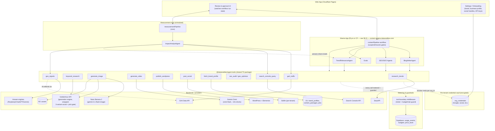

# Content Engine — Design & Delivery Plan

**Build target:** Mastra (TypeScript) orchestration layer + shared tool package, integrating with the existing Goldenhour (adgenai) generation service.
**Primary consumer:** LiveShareNow (livesharenow.com) content marketing — blog + social, built on product features and SEO/GEO keywords, incorporating trending topics, to drive site traffic.
**Status:** Draft for dev-team review. Decisions marked **[LOCKED]** are settled; **[OPEN]** items need a decision or a spike before the milestone that depends on them.
**Audience:** Engineering. Assumes familiarity with the Goldenhour codebase and the Cloudflare (Workers/Containers/D1/R2) stack.

---

## 1. Purpose & scope

Build a content-generation **engine** — not a single app — that:

1. Produces SEO/GEO-optimized blog posts and platform-specific social content for LiveShareNow, grounded in product features, target keywords, and live trending signals.
2. Exposes its capabilities as a **reusable, typed tool layer** that future Data Realities / Teevo / signage applications can consume without inheriting any LiveShare-specific assumptions.
3. Keeps a human in the loop on every irreversible action (publishing, posting).

The headline architectural decision (Section 3) is that the reusable unit is **tools**, not agents. Agents are thin and app-specific; tools are the durable asset.

### In scope (this plan)
- Shared TS tool package (`@datarealities/agent-tools`)
- Blog + social content pipeline as a Mastra workflow with **human selection gates** (human picks the trending topic; human picks 1 of 3 social variants)
- SEO + GEO optimization as explicit pipeline stages
- Trend research + relevance shortlisting (human picks the final topic)
- Image generation via **Nano Banana 2** and short-form video via **Gemini Omni** (§4.3)
- WordPress/Elementor publish + (gated) social posting
- **Measurement & attribution loop** — read Google Analytics (traffic), Search Console (SEO), and GEO signals to quantify whether published content moves rankings, answer-engine presence, and site traffic — and feed winners back into generation
- **Tenant self-service onboarding** — each org sets up its brand profile, business profile, and social handles, and supplies its own API keys (Google Analytics, Search Console, social posting, etc.) via a settings UI, stored in a per-tenant encrypted credential vault (§11)
- A web app that drives the end-to-end flow over workflow state
- Strangler-fig integration with Goldenhour

### Out of scope (future, leave architectural room)
- Backlink / digital-PR outreach workflow
- Long-form / multi-shot video — Gemini Omni Flash is capped at ~10s clips (good for Shorts); longer-form (Omni Pro) is later
- Migrating Goldenhour generation logic Python→TS wholesale (done incrementally, only where reuse demands)
- Full self-serve multi-tenant onboarding (LiveShare is the only near-term tenant; build SaaS-ready, operate single-tenant)

### Decisions locked (this revision)
The settled calls, with pointers to the section that carries the detail. Anything not here is still open (§14).

| # | Decision | Detail |
|---|---|---|
| Model | Internal tool for LiveShare now; multi-tenant **SaaS later** — build SaaS-ready, run single-tenant | §11 |
| Tenants | **LiveShare only** near-term → onboarding v1 is minimal (we enter creds), full self-serve deferred to the SaaS phase | §11.1 |
| First reuse consumer | A future **Campaign-optimization & data-analysis** app/agent → the measurement/analytics tools + impact data are the first real reuse target; contract them with extra care | §12 |
| Autonomy | Gated now, **"trusted auto-pilot" later** → gates are per-org, per-gate **mode-switchable from day one** (manual → auto, unlocked by track record) | §6 |
| Volume | **~7 posts/week** → three human gates are sustainable; budgets/rate-limits stay small | §6, §10 |
| WordPress | **Self-hosted, full access** → Elementor handling de-risked; only confirm blog body is Elementor vs Gutenberg | §8.1 |
| Social platforms | **IG / FB / Pinterest** in v1; **LinkedIn + TikTok** later → extensible platform enum | §4.3, §6 |
| Social variants | 3-variant generation is **net-new** (Goldenhour doesn't do it today) → built in Goldenhour, pick-1-of-3 gate there | §6 |
| Posting provider | **Buffer** (current), abstracted behind `post_social`; swappable later | §8.4 |
| Compute | **Fly.io** (lean); **GCP** as fallback, esp. if Gemini Omni needs Vertex | §8.2 |
| Data plane | **Supabase** for the new layer + metering; Goldenhour keeps its D1 path | §8.2 |
| Credentials | **Google OAuth**; per-tenant encrypted vault | §11.2 |
| Async | **Mastra run authoritative**; **Supabase Realtime** for status | §7, §8.2 |
| Tool package | **Single** `@datarealities/agent-tools` | §4.1 |
| Brand profile | **Stays in Goldenhour** | §7 |
| Budget | **~$3/day** per tenant (≈$90/mo) → **video is the cost risk**, make it opt-in per post | §10.3 |
| GEO measurement | **AI-referral only** in v1; probes / AI-Overview later | §12.3 |
| Impact analysis | **Human-reviewed reports/charts** (not an automated loop); **holdout** control set supported (we input control pages/keywords or parse them) | §12.4, §12.5 |
| Gemini Omni | Provision **API key / service account**; confirm direct API vs Vertex surface | §8.5 |

---

## 2. Background — current state (Goldenhour / adgenai)

What already exists and works (mid-deploy to Cloudflare; ~97 backend tests green):

| Capability | Where it lives today | Reuse posture |
|---|---|---|
| Blog + social generation, brand-profile-driven | Python backend, `get_brand_profile_for_org`, `brand_profiles` table | Wrap, then migrate |
| Trending research (SerpAPI) + ≥200% gate | Python; `trending_hashtag_threshold` (default 200%) | Wrap as `research_trends` tool |
| Platform-specific social shapes (IG / FB / Pinterest) + UTM | Python; canonical UTMs on `content_packages`, per-platform `final_url` in `social_graphics` jsonb | Reuse logic; expose via tools |
| Image generation | Gemini 2.5 Pro + Imagen 4.0 (pinned, deprecation-dated) | **Re-target to Nano Banana 2** (`gemini-3.1-flash-image-preview`) behind `generate_image` |
| Async jobs + status streaming | Job rows polled at 1Hz via SSE; `watchJobStatus` helper, polling fallback | Bridge to Mastra run state |
| Multi-tenant, org-scoped | `WHERE org_id = ?` everywhere; processors authorize from job row | Keep; tools take `org_id` explicitly; extend with per-tenant credential vault (§11) |
| Direct posting | Deferred — `ENABLE_DIRECT_POSTING=False`, Buffer used today | Becomes **3-variant social with a pick-1-of-3 human gate in Goldenhour**, then gated `post_social` |
| Deployment | CF Containers (Python backend) + Pages (frontend) + D1 + R2 | Mastra deploys alongside |

**Implication:** a large share of "generation" is already built. The new value is orchestration, SEO/GEO depth, gating, posting, and the reusable contract boundary — not re-building generation.

---

## 3. Architecture — the core reframe

### 3.1 The rule

> **Push intelligence down into well-contracted tools. Keep agents thin. Reuse happens at the tool layer.**

- **Tools** = typed, side-effect-y capabilities with a Zod input/output contract and **no ambient app/tenant/brand state**. This is the reusable asset. A future app imports the same `generate_image` or `research_trends` and inherits zero content-marketing assumptions.
- **Workflows** = deterministic pipelines that compose tools and agents, own execution order/branching, and host the human-approval suspend points. Reusable when the *shape* of a process repeats.
- **Agents** = LLM reasoning loops with a model + system prompt tuned for one job. **Built per app, never shared.** The LiveShare blog agent is not a reuse target.

Why: agents carry opinions (persona, model choice, prompt) that are exactly wrong to share. A tool with a clean contract is the most reusable artifact in the system; an agent is the least.

### 3.2 What's actually an agent vs a tool

| Piece | Classification | Rationale |
|---|---|---|
| Blog writer | **Agent** | Open-ended reasoning, iterative drafting, tool use |
| SEO optimization | **Agent / pass** | Reasoning over keyword targeting, meta, internal links |
| GEO optimization | **Agent / pass** | Restructure for answer-engine citability + schema |
| Trend relevance selection | **Agent** (small) → shortlist | Ranks/shortlists trends that fit LiveShare; **human picks the final topic (gate)** |
| Trend data retrieval | **Tool** (`research_trends`) | Deterministic SerpAPI call + threshold gate |
| Keyword data | **Tool** (`keyword_research`) | Deterministic API call |
| Image generation | **Tool** (`generate_image`) | Nano Banana 2 behind a stable contract |
| Short-form video | **Tool** (`generate_video`) | Gemini Omni Flash, async (~10s clips) |
| Social variant generation | **Tool/logic** (`compose_social`) | Produces **3 variants per platform**; selection gated in Goldenhour |
| WordPress publish | **Tool** (`publish_wordpress`), **gated** | Irreversible side effect, never an autonomous decision |
| Social posting | **Tool** (`post_social`), **gated** | Fires only after a human picks 1 of 3; never let an LLM *decide* to post |
| GA4 traffic read | **Tool** (`ga4_traffic`) | Read-only GA4 Data API call; no gate |
| Search Console read | **Tool** (`search_console_query`) | Read-only GSC API call; no gate |
| GEO signal read | **Tool** (`geo_signals`) | Read-only; AI-referral + (optional) citation probes |
| Impact analysis | **Agent** (`ImpactAnalystAgent`) | Correlates published content vs traffic/SEO/GEO signals over time |

### 3.3 System diagram



---

## 4. The shared tool layer (the reusable asset)

### 4.1 Package shape **[LOCKED]**
- A separate workspace package `@datarealities/agent-tools` from **day one** — not app code later extracted. This is the single most important structural call and is far cheaper now than as a retrofit.
- Per-domain submodules: `media/`, `research/`, `publishing/`, `profile/`, `seo/`.
- Versioned (semver), tested in isolation, no imports from any app.

### 4.2 Tool design rules **[LOCKED]**
1. **No ambient context.** `org_id` / brand are explicit parameters. A tool never reaches into a LiveShare-shaped request context. Config injected, never ambient.
2. **Pin the boundary, not the model.** The contract (`generate_image(prompt, aspect, brand) → asset`) stays stable while the model behind it churns. Callers never see Nano-Banana-vs-successor or Buffer-vs-Ayrshare specifics. Keep the existing pinned-model-string + deprecation-date discipline *inside* the tool.
3. **Side-effect tools don't decide.** `publish_wordpress` / `post_social` are invoked by a workflow step that may be suspended for human approval. The tool fires when called; it never self-triggers.
4. **Idempotency on writes.** Every side-effect tool takes an `idempotency_key`; resuming a suspended workflow must not double-publish/double-post.
5. **Zod in and out.** Typed contract is the unit of review and the reuse promise.

### 4.3 Contract sketches

> Illustrative — names/fields to be finalized in Milestone 0. The point is the *boundary shape*, not final field lists.

```ts
// research/research_trends.ts
export const researchTrends = createTool({
  id: "research_trends",
  inputSchema: z.object({
    topicDomain: z.string(),            // e.g. "weddings, events, celebrations"
    geo: z.string().optional(),
    lookbackDays: z.number().default(7),
    minIncreasePct: z.number().default(200), // mirrors trending_hashtag_threshold
  }),
  outputSchema: z.object({
    trends: z.array(z.object({
      term: z.string(),
      increasePct: z.number(),
      relatedQueries: z.array(z.string()),
      source: z.string(),
    })),
  }),
  execute: async ({ context }) => { /* SerpAPI; gate at minIncreasePct */ },
});

// media/generate_image.ts  — model hidden behind the contract; targets Nano Banana 2
export const generateImage = createTool({
  id: "generate_image",
  inputSchema: z.object({
    orgId: z.string(),
    prompt: z.string(),
    aspectRatio: z.enum(["1:1", "4:5", "9:16", "16:9"]),
    resolution: z.enum(["1k", "2k", "4k"]).default("1k"), // NB2 prices scale sharply with resolution
    brandRef: z.object({ primaryColor: z.string().optional() }).optional(),
    count: z.number().default(1),
  }),
  outputSchema: z.object({
    assets: z.array(z.object({ r2Key: z.string(), url: z.string(), width: z.number(), height: z.number() })),
  }),
  // Nano Banana 2 = gemini-3.1-flash-image-preview (preview suffix is load-bearing). Caller never sees the string.
  execute: async () => { /* Gemini API image gen; image arrives as inline_data in candidates[].content.parts */ },
});

// media/generate_video.ts  — short-form video / Shorts via Gemini Omni; async (returns a job to poll)
export const generateVideo = createTool({
  id: "generate_video",
  inputSchema: z.object({
    orgId: z.string(),
    prompt: z.string(),
    aspectRatio: z.enum(["9:16", "16:9", "1:1"]).default("9:16"), // 9:16 for Shorts/Reels
    durationSeconds: z.number().max(10).default(10),              // Omni Flash caps ~10s
    refImageR2Key: z.string().optional(),                        // image-to-video
  }),
  outputSchema: z.object({ jobId: z.string(), status: z.enum(["queued", "running", "done", "failed"]) }),
  // Gemini Omni Flash (gemini-omni-flash). NOTE: confirm direct Gemini API access vs Vertex/aggregator at integration (§4.4).
  // Async: returns jobId; the workflow step polls to completion (same pattern as Goldenhour jobs). SynthID watermark is non-disableable.
  execute: async () => { /* submit Omni job; poll status; on done, store rendered clip in R2 */ },
});

// publishing/publish_wordpress.ts  — gated, idempotent
export const publishWordpress = createTool({
  id: "publish_wordpress",
  inputSchema: z.object({
    orgId: z.string(),
    idempotencyKey: z.string(),
    title: z.string(),
    contentHtml: z.string(),
    elementor: z.object({ templateId: z.number(), data: z.unknown() }).optional(), // see §8.1 caveat
    meta: z.object({ description: z.string(), focusKeyword: z.string() }),
    schemaJsonLd: z.unknown(),
    utm: z.object({ source: z.string(), medium: z.string(), campaign: z.string() }),
    status: z.enum(["draft", "publish"]).default("draft"),
  }),
  outputSchema: z.object({ postId: z.number(), url: z.string(), status: z.string() }),
  execute: async () => { /* WP REST; Elementor via _elementor_data or template — spike required */ },
});

// publishing/post_social.ts  — gated, idempotent; only ever called with the human-chosen variant
export const postSocial = createTool({
  id: "post_social",
  inputSchema: z.object({
    orgId: z.string(),
    idempotencyKey: z.string(),
    platform: z.enum(["instagram", "facebook", "pinterest", "linkedin", "tiktok"]), // v1 uses first 3; linkedin/tiktok later
    caption: z.string(),               // the 1-of-3 variant the human picked in Goldenhour
    mediaRefs: z.array(z.string()),    // R2 keys
    finalUrl: z.string(),              // per-platform; mirrors social_graphics jsonb
    scheduledAt: z.string().datetime().optional(),
  }),
  outputSchema: z.object({ postRef: z.string(), status: z.string() }),
  execute: async () => { /* Buffer (per-tenant token); respects ENABLE_DIRECT_POSTING flag */ },
});
// Note: variant generation (3 per platform) is `compose_social`, run in Goldenhour, which also hosts the pick-1-of-3 gate.

// profile/fetch_brand_profile.ts  — wraps Goldenhour's source of truth
export const fetchBrandProfile = createTool({
  id: "fetch_brand_profile",
  inputSchema: z.object({ orgId: z.string() }),
  outputSchema: z.object({
    tone: z.string(), audience: z.string(), positioning: z.string(),
    doUse: z.array(z.string()), dontUse: z.array(z.string()),
    primaryColor: z.string(),
    trendingHashtagThreshold: z.number(),
  }),
  execute: async () => { /* reads brand_profiles via get_brand_profile_for_org */ },
});
```

Also: `keyword_research`, `seo_onpage_audit`, `geo_optimize` (the last may be implemented as an agent pass rather than a pure tool — decide in Milestone 2).

### 4.4 Model bindings (pinned, hidden behind contracts)

Callers never see these strings — they live inside the tools and the `price_book` (§10.2). Pin them with the same deprecation-date discipline Goldenhour already uses.

| Capability | Model | API string | Notes / confirm at integration |
|---|---|---|---|
| Image | **Nano Banana 2** (Gemini 3.1 Flash Image) | `gemini-3.1-flash-image-preview` | Released Feb 2026; **preview suffix is required**; image returns as `inline_data` in `candidates[].content.parts`; price scales with resolution (1k/2k/4k) — default 1k |
| Short-form video / Shorts | **Gemini Omni Flash** | `gemini-omni-flash` | I/O 2026 model; ~10s clip cap (fits Shorts); async; SynthID watermark non-disableable. **Confirm direct Gemini API availability** vs Vertex/aggregator — general API access was still rolling out as of late May 2026. Build `generate_video` against the contract so the binding can swap without caller changes |
| Text (blog/SEO/GEO agents) | Mastra model router | (router-selected) | Keep router indirection; pin the specific text model + price in `price_book` |

Because the bindings sit behind `generate_image` / `generate_video`, swapping Nano Banana 2 → a successor, or Omni Flash → Omni Pro for longer clips, is a one-line change with no caller impact — this is the "pin the contract, not the model" rule paying off immediately.

---

## 5. Agents (thin, app-specific)

| Agent | Job | Key inputs | Notes |
|---|---|---|---|
| `BlogWriterAgent` | Draft a post from a brief | brand profile, selected trend, keyword set, product feature | The one genuinely agentic piece |
| `SEOEditorAgent` | Optimize draft for a focus keyword | draft, `keyword_research` output, internal-link map | Pass over the draft |
| `GEOAgent` | Restructure for answer-engine citability + JSON-LD | draft | Declarative claims, Q&A blocks, sourced stats, schema. Encode the seven-part SEO/GEO guide as its rubric |
| `TrendRelevanceAgent` | **Shortlist** trends that fit LiveShare for a human to pick from | `research_trends` output, brand positioning | Ranks/filters to a shortlist; a human makes the final pick at GATE 0 (§6) |
| `ImpactAnalystAgent` | Quantify post-publish impact on traffic/SEO/GEO | published content + GA4/GSC/GEO signals | Runs in the measurement loop (§12), not the generation pipeline |

All four generation agents are LiveShare-specific and live in the app, not the shared package. `ImpactAnalystAgent` likewise; the **tools** it calls (`ga4_traffic`, `search_console_query`, `geo_signals`) are app-agnostic and shared.

---

## 6. Orchestration — `contentPipeline` workflow

A single Mastra workflow owns the end-to-end flow and **three human gates** (Mastra `suspend`/`resume`).

```
research_trends (tool)
  → TrendRelevanceAgent (agent)  → shortlist of candidate topics
  → ▣ SUSPEND — GATE 0: human picks the trending topic
  → keyword_research (tool)
  → BlogWriterAgent (agent)
  → SEOEditorAgent (agent)
  → GEOAgent (agent)  → final HTML + JSON-LD
  → generate_image (tool, Nano Banana 2)  → hero + social assets
  → generate_video (tool, Gemini Omni)  → optional short (async; v-later)
  → ▣ SUSPEND — GATE 1: human approves blog + assets
  → publish_wordpress (tool, draft|publish)
  → compose_social (Goldenhour)  → 3 variants per platform + UTM tagging
  → ▣ SUSPEND — GATE 2 (in Goldenhour): human picks 1 of 3 social variants
  → post_social (tool, chosen variant)   // or hand to human while ENABLE_DIRECT_POSTING=False
  → record_results (tool)  // writes publish date + target keyword + utm_campaign → feeds the measurement loop (§12)
```

Notes:
- **Three gates, all human (for now):** GATE 0 picks the topic (human chooses from the shortlist), GATE 1 approves the draft + assets, GATE 2 picks 1 of 3 social variants (this gate is hosted in Goldenhour's UI, which already owns platform-shape rendering). All use suspend/resume; idempotency keys protect against double-fire on resume.
- **Gate policy — design for auto-pilot from day one.** Each gate reads a per-org, per-gate **mode** (`manual` | `auto`) from config rather than hard-coding the suspend. v1 ships every gate `manual`; the planned **"trusted auto-pilot"** is then a config flip per gate (e.g. auto-pick the top-ranked topic, or auto-select variant 1) once the agent's picks have a measured track record — no pipeline rewrite. Keep `post_social` itself always behind `ENABLE_DIRECT_POSTING` regardless of gate mode, so "auto-select" never silently becomes "auto-publish" without a separate, explicit switch.
- **3-variant generation is net-new.** Goldenhour doesn't produce variants today, so `compose_social` (3 per platform) is new work, built in Goldenhour alongside the existing platform-shape logic; the pick UI lives there too.
- **At ~7 posts/week, three manual gates are easily sustainable** — the gates are about brand control, not a throughput bottleneck; auto-pilot is a toil-reduction lever for later, not a scaling necessity.
- **Why gate the topic and the variant, not auto-pick:** the agent narrows the field, the human owns the choice. Cheap on attention, and it keeps brand judgement with a person.
- **Trending caption signal** stays as-is: only fires for `topic_source='trending'` where `increase_pct >= trending_hashtag_threshold`; IG hashtag end-of-stack, FB first-line prefix, Pinterest skipped.
- **UTM** keeps the existing pattern: canonical campaign columns on `content_packages` as the single source of truth; per-platform `final_url` in `social_graphics` jsonb as the audit trail.

---

## 7. Goldenhour integration — strangler-fig **[LOCKED approach]**

Do **not** big-bang rebuild a working, tested system. Stand the new layer up beside Goldenhour and migrate inward.

| Phase | Mastra owns | Goldenhour provides | Exit criteria |
|---|---|---|---|
| **0 — Wrap** | Orchestration, gates, SEO/GEO (new) | Generation (blog text, image) + brand profile + data model, exposed as tools via an HTTP adapter | End-to-end run green against existing Goldenhour |
| **1 — Native new capabilities** | SEO/GEO, keyword research, trend relevance, posting, tracking — all TS-native | Still generation engine | New capabilities have no Python dependency |
| **2 — Migrate generation** | Generation tools move into `@datarealities/agent-tools` TS, one capability at a time, **only where reuse demands** | Shrinking | A second consumer (another app) successfully imports a migrated tool |
| **3 — Decide Goldenhour's fate** | — | Either retired (Python container removed) or kept as LiveShare-specific data plane | Explicit decision; not forced |

**Seams to get right:**
- **Brand profile** stays the single source of truth in `brand_profiles` (D1). `fetch_brand_profile` wraps `get_brand_profile_for_org`. New customer = INSERT row, no code change — preserve that property.
- **Async bridge [OPEN].** Goldenhour has its own job rows + 1Hz SSE; Mastra workflows have their own run state with suspend/resume. **Decision needed:** Mastra run state is the orchestration source of truth; Goldenhour jobs are generation sub-tasks. A workflow step that kicks a long Goldenhour job must poll that job to completion before resolving the step. The web app watches the **Mastra run**, not the Goldenhour job, to avoid two competing status systems.
- **Models** keep pinned strings + deprecation dates *inside* the tool, invisible to callers — now **Nano Banana 2** (`gemini-3.1-flash-image-preview`) for images and **Gemini Omni Flash** (`gemini-omni-flash`) for shorts (§4.4). Goldenhour's current Imagen 4.0 path is superseded by the `generate_image` binding.

---

## 8. Known technical landmines

### 8.1 WordPress + Elementor publishing **[OPEN — spike required]**
Publishing a blog post is straightforward via the WP REST API; publishing one that renders as an **Elementor** layout is not. Elementor stores its layout as serialized JSON in the `_elementor_data` post-meta key, not in `post_content`. Options, in increasing fidelity:
1. **Classic/Gutenberg HTML** into `post_content` (skip Elementor for blog body) — simplest, ship first.
2. **Fixed Elementor template** with a content placeholder, populated by writing `_elementor_data` JSON per post — medium effort, needs a template contract.
3. **Full programmatic Elementor tree** — high effort, brittle across Elementor versions.

**Recommendation:** Milestone 4 ships option 1 (draft status) to unblock the pipeline; schedule a spike to decide 2 vs 3. The `publish_wordpress` contract already carries an optional `elementor` field so the upgrade is non-breaking.

### 8.2 Compute & data plane — Fly.io / Supabase now on the table **[OPEN — recommendation below]**

Two sub-decisions, both newly easier now that Fly.io and Supabase are available.

**Compute (where Mastra runs).** Mastra is a Node server; Cloudflare Workers imposes runtime constraints that a long-running agent server with suspend/resume can fight. **Fly.io runs the container with a full Node runtime, no gymnastics — and Goldenhour's Python service (which currently *requires* CF Containers) is equally at home on Fly.** Running both as Fly apps collapses two awkward deployment stories into one.
→ **Lean: Mastra + Goldenhour as Fly apps.** This removes the Workers-fit question entirely. **GCP is the sensible fallback** — you're already Google-heavy (Gemini, GA4, Search Console, OAuth), and if Gemini Omni ends up Vertex-only (§8.5), running that piece on GCP avoids cross-cloud auth friction; Cloud Run would host the same containers. Fly first for simplicity; revisit GCP if Omni/Vertex forces it.

**Data plane (D1 vs Supabase Postgres).** D1 work is in flight (PR 7). Supabase advantages relevant here:
- Real Postgres + **row-level security**, which formalizes the org-scoping you already enforce in app code.
- **Realtime** — a clean replacement for the 1Hz SSE column-polling that your own Goldenhour notes flag for migration at "5+ progress messages per job OR multi-replica deployment." This retires the async-bridge friction (§7) instead of working around it.
- **pgvector** for any future RAG (product-docs grounding for the blog agent).
- A natural home for the usage-metering analytics workload (§10).

The cost: PR 7's D1 migration is mid-flight; don't rip it out under deploy pressure.

→ **Lean (strangler-fig for infra too): build the *new* layer — Mastra orchestration + usage metering + workflow run state — on Fly + Supabase. Let Goldenhour finish its D1 path; converge later if Supabase proves out.** Keep **R2 for assets** regardless — it's already wired and egress is free, so there's no reason to move blobs.

Proposed hosts: `content-engine.datarealities.com` (Mastra on Fly), Supabase project for orchestration + metering, R2 for assets, Goldenhour as-is until convergence.

### 8.3 Double-publish on resume
Suspend/resume + irreversible side effects = duplicate-write risk. Mandatory `idempotency_key` on `publish_wordpress` and `post_social`; tool checks-then-writes.

### 8.4 Social posting provider — Buffer **[current; abstracted + swappable]**
LiveShare posts through **Buffer** today, so `post_social` targets Buffer, resolved per tenant from the credential vault (§11). Build it behind the contract so swapping providers (Ayrshare, Publer, or direct platform APIs) is a one-tool change — the user already noted Buffer can change later. **Confirm at integration:** Buffer's publishing API access has been gated/limited at times, so verify the plan exposes the publish endpoints for IG / FB / Pinterest (and LinkedIn / TikTok when those land); if not, the abstraction lets you swap without touching callers. Posting always fires the **1-of-3 variant a human chose** at GATE 2 (§6), and stays manual (`ENABLE_DIRECT_POSTING=False`) until you flip it on.

### 8.5 Gemini Omni API availability **[OPEN — confirm before the video milestone]**
Gemini Omni (Flash) is recent; **direct Gemini API access was still rolling out** as of late May 2026, with Vertex AI / aggregators as alternate surfaces. Confirm the available surface and exact model string before building `generate_video`. The ~10s clip cap suits Shorts; treat long-form as out of scope until Omni Pro. Because the binding sits behind the `generate_video` contract (§4.4), the surface can change without touching callers.

---

## 9. Quality — evals **[LOCKED to include from day one]**
Wire Mastra evals in from the first generation milestone so quality is measured, not assumed (and to reduce human-review load at the gates):
- **Blog:** brand-faithfulness (tone / do_use / dont_use adherence), focus-keyword coverage, factual grounding in product features.
- **GEO:** citability rubric derived from the seven-part SEO/GEO guide (declarative claims present, Q&A structure, sourced stats, valid JSON-LD).
- **Social:** platform-shape correctness, UTM presence, trending-signal placement rules.

Evals run before Gate 1; failing drafts don't reach a human.

---

## 10. Usage metering & cost guardrails **[LOCKED to include from day one]**

Goal: full attribution of every GenAI and external-API call — *how much, by whom, for what* — plus enforceable budget and rate guardrails so nothing runs away. Agentic loops are the #1 runaway-cost source, so this is foundational, not a later add-on.

### 10.1 Meter at the tool boundary
Every model/provider call already goes through a tool, so the tool layer is the one choke point. Wrap tool execution in **metering middleware** (a Mastra middleware / tool wrapper) that records one append-only `usage_events` row per call. Because tools carry no ambient context (§4.2), attribution is exact and works identically across every future app that imports the package — cost attribution comes *for free* with the tool-boundary design.

`usage_events` (append-only):

| Column | Notes |
|---|---|
| `ts` | call timestamp |
| `org_id` | tenant |
| `app_id` | which application (LiveShare content engine, future apps) — first-class column |
| `run_id`, `step_id` | workflow run + step |
| `caller` | `agent_id` or `tool_id` |
| `provider`, `model` | the pinned model string |
| `call_type` | `genai_tokens` \| `image` \| `video` \| `api_request` |
| `unit_type` | `tokens` \| `images` \| `requests` \| `credits` |
| `input_tokens`, `output_tokens`, `units` | usage, by unit type |
| `cost_usd` | computed at write time from the price book |
| `latency_ms`, `status`, `error_class` | health |
| `idempotency_key` | correlate with side-effect tools |

**Two unit kinds, one table.** GenAI calls (Nano Banana 2 images, Gemini Omni video, text models) are token- or image- or task-priced; external APIs (SerpAPI, Buffer) are request/credit-priced. `unit_type` lets both live in one schema — the user asked to cover "Gen AI calls **and** API calls."

### 10.2 Price book — pin prices like you pin models
Extend the existing pinned-model-string + deprecation-date discipline with a `price_book` (model/provider → price per unit). Cost is computed at metering time from this table, so a provider price change is a deliberate config edit, not silent drift. Mastra's model router already returns token usage per call — capture it; don't estimate. Seed it with the current bindings (§4.4): **Nano Banana 2** image pricing scales by resolution (1k/2k/4k), **Gemini Omni** is billed per video task, SerpAPI/Buffer are request/credit-priced. For tenant-supplied API keys (Google, social — §11), those calls run on the customer's own quota/billing; still record a `usage_event` for visibility, with `cost_usd = 0` on the platform's books.

### 10.3 Guardrails (layered, enforced at the same middleware)
The tool-boundary middleware does **pre-call guard** and **post-call meter** in one place:

1. **Per-run ceilings.** Agent `maxSteps` + a per-run token cap. Hard stop on runaway loops. *(Cheapest, highest-leverage guardrail — set it first.)*
2. **Per-org / per-app budgets.** Monthly + daily caps in a `budgets` table. Pre-call check; over budget → **block, emit event, and suspend the workflow for a human decision** (never silently fail mid-pipeline).
3. **Rate limits.** Per-org / per-provider QPS so a loop can't hammer an API.
4. **Provider kill switch.** Per-provider enable flag — generalize the existing `ENABLE_DIRECT_POSTING` pattern to every provider. Trip on cost spike or provider incident.
5. **Threshold alerts.** 50 / 80 / 100% of budget → notify (Slack / email).

**Concrete numbers for LiveShare:** daily cap **~$3/org** (≈$90/mo), with the per-run token ceiling set so one post can't consume the day in a single loop. At ~7 posts/week, text + a few Nano Banana 2 images (1k tier ≈ a few cents each) sit comfortably under $3/day. **The line item that can blow the cap is Gemini Omni video** — a single video task can dwarf a day's image+text spend. So: make `generate_video` **opt-in per post** (not part of the default run), and give it its own sub-budget / per-call confirmation. The kill switch and per-provider flag matter most for the video provider.

### 10.4 Observability vs metering
Mastra ships OpenTelemetry-based tracing. Keep both and don't conflate them: **tracing** answers "what happened in this run," **metering** answers "what did it cost and who used it." Export traces to your OTel sink; write usage to `usage_events`. A live cost meter in the web app can subscribe via Supabase Realtime.

### 10.5 Where it lives
`usage_events` / `budgets` / `price_book` are an excellent fit for **Supabase Postgres** (append-only analytics, RLS by `org_id`, native dashboards, Realtime for a live spend meter) — see §8.2. The same schema works on D1 if you stay Cloudflare-only, but dashboards and ad-hoc cost queries are then more DIY.

---

## 11. Security, multi-tenancy & tenant onboarding **[LOCKED principles; vault mechanism OPEN]**

### 11.1 Tenant self-service onboarding
Each org configures itself through a settings UI (in the web app, and/or surfaced in Goldenhour) — no code change to add a customer, preserving Goldenhour's existing "new customer = INSERT row" property. Onboarding captures:
- **Brand profile** — tone, audience, positioning, do_use / dont_use, primary color, `trending_hashtag_threshold` (the existing `brand_profiles` shape).
- **Business profile** — site URL, product/feature catalog the blog agent draws on, target locales.
- **Social handles** — the accounts that `compose_social` / `post_social` target.
- **API credentials (BYO keys)** — Google Analytics, Search Console, social posting (Buffer), and any other per-tenant provider. Entered by the customer, stored in the credential vault (§11.2).

**v1 scope (LiveShare-only):** keep the onboarding UI minimal — the data model and vault are built multi-tenant, but for v1 you populate LiveShare's profile + connect its credentials yourself; the full self-serve signup/onboarding flow is a SaaS-phase deliverable, not v1. Build the *structure* now (so SaaS is a UI-and-billing addition, not a re-architecture), but don't gold-plate the signup UX while there's one tenant.

### 11.2 Per-tenant credential vault **[Supabase Vault recommended]**
Customer-supplied keys are tenant data, not platform config, so they live in a **per-org encrypted vault**, separate from the platform's own secrets.
- **Encrypted at rest**, never plaintext columns, never logged, never placed in URLs or query strings. Since the data plane is Supabase (locked), **Supabase Vault** is the natural fit; KMS envelope encryption is the fallback if you outgrow it. Either way the rule is the same — ciphertext at rest, decrypt only at call time.
- **Resolved per `org_id` at call time** and injected into the tool. This *reinforces* the no-ambient-context rule: the tool receives a ready client/credential as a parameter; it never reaches into tenant state itself. Same design that makes tools reusable makes credentials cleanly scoped.
- **Prefer OAuth over pasted keys for Google** (GA4 / Search Console): the user grants read access and you store a refresh token, which is better UX and lower blast radius than a pasted service-account JSON — though support the service-account path too. For social, use per-tenant Buffer tokens (§8.4).
- **Two secret tiers, kept distinct:** *platform secrets* (your own SerpAPI, Gemini/Nano-Banana/Omni, Supabase service key, R2) in the platform store; *tenant secrets* (the customer's Google/social credentials) in the per-org vault. GenAI generation runs on platform keys (metered + billable per org, §10.2); analytics/posting run on the tenant's own keys and quota.

### 11.3 Baseline security rules
- Org-scoped everywhere; tools take `org_id` explicitly. Workflow steps authorize from run context, not request context. On Supabase, back this with **row-level security** keyed on `org_id` — including the vault and metrics tables.
- Platform secrets via the platform's secret store (`fly secrets set` / `wrangler secret put`) — never inline, never echoed.
- No secrets in this repo; deploys run by the platform owner, not CI, unless a deploy gate is explicitly chosen.
- The credential-entry UI is the customer entering their *own* keys into their *own* tenant; the system stores and uses them, and never exposes one tenant's keys to another or to logs/traces.

---

## 12. Measurement & attribution loop **[the closed loop — without this, generation is blind]**

The generation pipeline (§6) is open-loop on its own: it produces content but never learns whether the content *worked*. This section closes the loop — read GA4 (traffic), Search Console (SEO), and GEO signals, quantify per-post and per-campaign impact against a baseline, and surface it for human review (and, later, feed winners back into generation).

**These are your first real reuse target.** The planned Campaign-optimization & data-analysis app/agent will consume exactly these tools (`ga4_traffic`, `search_console_query`, `geo_signals`) and the `content_impact` data — so contract them as if a second app already depends on them (clean Zod boundaries, `org_id` explicit, no content-engine assumptions baked in). This is the concrete "second consumer" that justifies the shared-package discipline.

### 12.1 Read-only tools (shared package, `org_id` explicit, no human gate)

| Tool | Source | Returns | Joins to content on |
|---|---|---|---|
| `ga4_traffic` | GA4 Data API (`runReport`) | sessions, users, engaged sessions, conversions, by `landingPage` / `sessionSourceMedium` / **`sessionCampaignName`** / date | **`utm_campaign`** |
| `search_console_query` | GSC Search Analytics API | clicks, impressions, CTR, **average position**, by `query` / `page` / date | page URL + target keyword |
| `geo_signals` | see §12.3 | answer-engine presence / citation share, AI-referral sessions | brand + target query |

**Why the UTM design pays off here:** the publish step already stamps `utm_campaign` on `content_packages`. GA4 surfaces that exact campaign as `sessionCampaignName`, so traffic attributes back to the specific post with no extra join key. The loop closes on a column you already write.

### 12.2 SEO measurement (Search Console)
For each published page's target keyword, track clicks / impressions / CTR / average position over time, compared to that page's own pre-publish baseline. Caveats the team must design around: GSC data lags ~2–3 days, returns limited/sampled rows, and **retains only 16 months** — so the measurement loop must **backfill and store history locally** (Supabase) to keep a record beyond GSC's window.

### 12.3 GEO measurement — be honest that this is immature
There is no clean "did an AI engine cite us" API. Three sub-approaches, layered by feasibility:

1. **AI-referral traffic (measurable today, solid).** GA4 referrals from `chatgpt.com`, `perplexity.ai`, `gemini.google.com`, etc. — a real proxy for click-throughs from AI answers. Needs a custom channel grouping / source regex since some land as `direct`. Ship this first; it's the reliable leading indicator.
2. **Synthetic citation probes (emerging, directional).** Run a *fixed, versioned panel* of representative prompts against answer engines on a schedule; record whether the brand/domain appears as a cited source and its share-of-voice vs competitors. Perplexity's API returns citations directly (cleanest); ChatGPT/Gemini need prompt-and-parse. These calls cost money → **meter them (§10)**; results are noisy → track the trend, not a single reading. Changing the prompt panel breaks comparability, so **pin the panel like you pin models/prices**.
3. **AI Overview presence (medium).** Detect whether Google AI Overviews appear and cite you for target queries, via a SERP source that flags AI-Overview blocks.

**v1 recommendation:** ship (1) only. Add (2)/(3) once (1) is trusted. Mark this clearly so nobody over-invests in fragile probe infrastructure before the basics report cleanly.

### 12.4 `measurementPipeline` — a scheduled, read-only workflow
A cron workflow, sibling to `contentPipeline`:

```
[cron, e.g. daily]
  ga4_traffic → search_console_query → geo_signals   (pull, store time series)
  → ImpactAnalystAgent: join signals to published content, compute pre/post lift vs baseline (incl. holdout comparison)
  → write content_impact rollup
  → render a human-reviewable impact report / charts in the web-app dashboard
  → [human reviews the lift; decides what to feed back into briefs]   ← v1: human-mediated, not automated
```

No side effects → no human gate on the *pipeline*. It only reads and writes its own metrics tables; the "decision" it produces is a **report for a person**, not an automated action. The feedback into generation is **human-mediated in v1** (a person reads the charts and shapes the next brief); automating that edge is a later step, gated on the auto-pilot track record (§6).

### 12.5 Methodology — measure impact, don't fool yourself **[LOCKED stance]**
The point of this loop is honest attribution, so the analysis has to resist the easy lie that publishing caused the lift:

- **Baseline + pre/post, not raw counts.** Compare a page/keyword's trajectory after publish against its own prior baseline.
- **Hold out a control set.** Leave a set of comparable pages/keywords *untouched* so observed lift can be checked against a counterfactual rather than the calendar. **You provide the control set** — input the specific pages/SEO keywords to hold out, or let the analyst parse the candidate set from the site and you confirm. This is a confirmed v1 inclusion.
- **Respect SEO lag.** Rankings move over weeks-to-months; week-1 movement is mostly noise. Set an evaluation window (≈4–12 weeks) before judging SEO impact. Traffic and social impact read faster; GEO is in between and noisier.
- **Correlation ≠ causation.** Seasonality, core algorithm updates, and trend spikes confound. Report *lift with caveats*, and lean on the holdout for anything stronger.
- **Output is a human-reviewed report, not an automated verdict.** v1 delivers charts/reports a person reads to judge lift and decide next moves; nothing auto-acts on the numbers.

This makes evals and measurement two distinct loops: **evals (§10) gate quality *before* publish; the measurement loop gates impact *after* publish.** Don't conflate them.

### 12.6 Storage & auth
- **Storage:** `ga4_metrics`, `gsc_metrics`, `geo_signals`, and a `content_impact` rollup in **Supabase**, joined to `content_packages` on campaign / URL. Same analytics plane as `usage_events`; dashboards + Realtime for the web app.
- **Auth:** GA4 Data API + GSC API via **Google OAuth** (locked) with **read-only** scope — the tenant grants reader access and you store a refresh token in the vault (§11.2). No write scope, ever.

---

## 13. Delivery plan (PR-sized, brief → approve → implement → verify)

Mirrors the existing Goldenhour cadence: each milestone is a brief, an approval, an implementation with a PR description, then a runtime-verification gate.

| # | Milestone | Output | Verification gate |
|---|---|---|---|
| **0** | Scaffold | Monorepo: `@datarealities/agent-tools` (Zod contracts, no impl) + Mastra app skeleton + CI + (chosen infra: Fly app + Supabase project) | CI green; contracts compile |
| **0.5** | Metering & guardrails foundation | Tool-boundary middleware + `usage_events` / `price_book` / `budgets` schema + per-run token ceiling + kill-switch flags | Every (stub) tool call writes a `usage_event` with cost; over-budget call is blocked |
| **1** | Onboarding + credential vault | Settings UI (brand, business profile, social handles, API keys) + per-tenant encrypted vault + per-`org_id` credential resolution into tools | A new org self-configures; a tool resolves that org's key with no ambient context |
| **2** | Read-only tools | `fetch_brand_profile`, `research_trends`, `keyword_research` + `TrendRelevanceAgent` (shortlist) | Returns real LiveShare data; trend gate fires at threshold; usage metered |
| **3** | Draft generation | `BlogWriterAgent` + SEO + GEO passes + evals. Output = draft only, no publish | Eval scores recorded; per-run token ceiling enforced; human reads sample drafts |
| **4** | Image gen + Gate 0/1 | `generate_image` (**Nano Banana 2**) + GATE 0 (topic pick) + GATE 1 (draft/asset approval) + web-app review UI | Pick topic, approve draft+assets in the UI |
| **5** | WordPress publish | `publish_wordpress` (option 1, **draft** status) + idempotency | Draft post appears in WP, correct meta/schema |
| **6** | Social 3-variant + Gate 2 | `compose_social` (3 variants/platform) + UTM + pick-1-of-3 gate **in Goldenhour** + `post_social` (per-tenant Buffer; manual/draft first) | 3 variants shown; human pick posts/queues the chosen one; UTMs correct |
| **7** | Orchestration | `contentPipeline` ties it end-to-end (all 3 gates); web app over run state + live spend meter | One topic → published draft + chosen social, fully gated |
| **8** | Measurement reads | `ga4_traffic`, `search_console_query`, `geo_signals` (AI-referral only) + Supabase metrics tables + backfill | Live GA4/GSC data stored; campaign + page joins resolve |
| **9** | Impact analysis | `ImpactAnalystAgent` + `measurementPipeline` cron + `content_impact` rollup + **human-reviewable reports/charts** (incl. holdout comparison) | Per-post/per-campaign lift vs baseline + holdout shown as charts a person reviews |
| **10** | Human-mediated feedback | Reports surface winning topics/keywords; a person folds them into the next briefs (no auto-action in v1) | A new brief is demonstrably shaped by a reviewed report |
| **11** | Short-form video | `generate_video` (**Gemini Omni Flash**, async ~10s) wired into the pipeline as an optional asset | A Shorts-ratio clip generates, stores to R2, and surfaces at GATE 1 |
| **F** | Future | Backlinks workflow; long-form video (Omni Pro); GEO citation probes (§12.3 #2/#3); holdout-based causal eval; TS-native generation migration; 2nd app consuming the tool package + shared metering | per-feature |

**Milestone blockers (only the external confirmations from §14 remain — all design decisions are locked in §1):**
- Milestones 0–4, 7, 9–10: no external blocker — proceed on the locked decisions (Fly + Supabase, OAuth, single tool package, $3/day budget, AI-referral GEO, human-reviewed reports).
- Milestone 5 (WordPress publish): confirm blog body is Elementor vs Gutenberg (§14 #1).
- Milestone 6 (social posting): confirm Buffer publish API on your plan (§14 #2).
- Milestone 8 (measurement reads): create the Google OAuth client + connect LiveShare's GA4/GSC properties (§14 #4).
- Milestone 11 (video): confirm Gemini Omni surface + model string (§14 #3).

---

## 14. Remaining items (external confirmations, not design choices)

The design choices are settled — see **Decisions locked (§1)**. What's left isn't a decision you make by fiat; it's a handful of facts to confirm against external systems before the milestone that needs them:

1. **Blog body: Elementor or Gutenberg?** You host WP with full access, so publishing is de-risked either way — but this determines whether the §8.1 Elementor path is needed at all. *Confirm before Milestone 5.*
2. **Buffer publish API on your plan.** Buffer's API has been gated at times; verify your plan exposes publishing for IG/FB/Pinterest (and later LinkedIn/TikTok). If it doesn't, `post_social`'s abstraction lets you swap providers without touching callers. *Confirm before Milestone 6.*
3. **Gemini Omni surface + model string.** Direct Gemini API vs Vertex (service account) — pick whichever you can provision, and pin the exact string. May tilt compute toward GCP (§8.2, §8.5). *Confirm before Milestone 11.*
4. **Google OAuth client setup.** You'll create the OAuth app/client for GA4 + Search Console read scopes and connect LiveShare's properties — a task, not a decision. *Needed for Milestone 8.*

Everything else (compute, data plane, credentials style, posting provider, gates, budgets, GEO scope, evaluation approach, tool-package shape, brand-profile ownership) is locked in §1.

---

## 15. Design principles (the one-page version for reviewers)

1. Tools are the reusable asset. Agents are thin and disposable.
2. No ambient state in tools — `org_id`/brand are parameters.
3. Pin the contract, not the model. (And pin prices, and pin the GEO prompt panel.)
4. Every irreversible action sits behind a human gate (suspend/resume), with an idempotency key — and the human owns the *choices* too (pick the topic, pick 1 of 3 social variants); the agent only narrows the field.
5. Meter at the tool boundary: every GenAI/API call is attributed (org, app, model, cost) and bounded (per-run ceiling, per-org budget, kill switch) before it can run away.
6. Tenant keys are tenant data: customers bring their own credentials into a per-org encrypted vault, resolved by `org_id` and injected into tools — never ambient, never logged, kept separate from platform secrets.
7. Strangle Goldenhour, don't rebuild it — and apply the same to infra: new layer on Fly + Supabase, converge the rest later.
8. Two loops, not one: evals gate quality *before* publish; the measurement loop gates impact *after* publish. Close the loop — measure SEO/GEO/traffic against a baseline and feed winners back into generation, but report lift, not causation.
9. Build the LiveShare flow now — but as if the tool layer were already a shared package. Genericize on the second real consumer, not the first hypothetical one.
